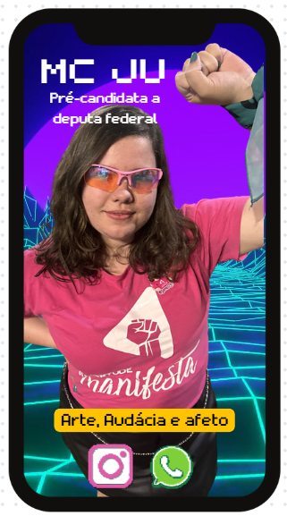
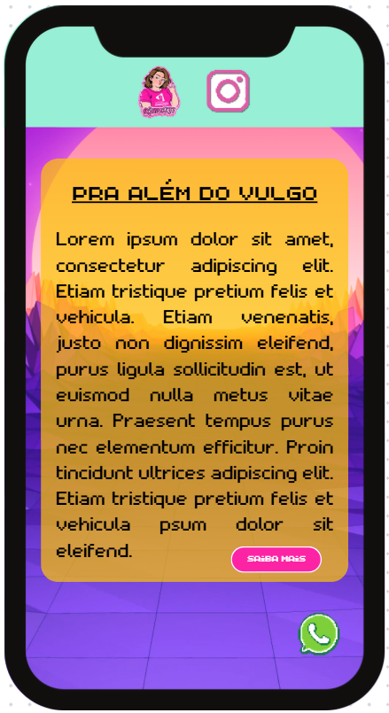
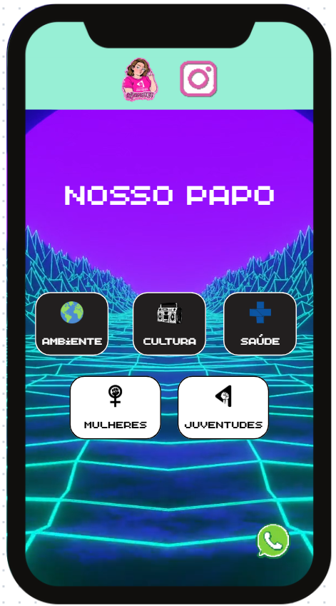
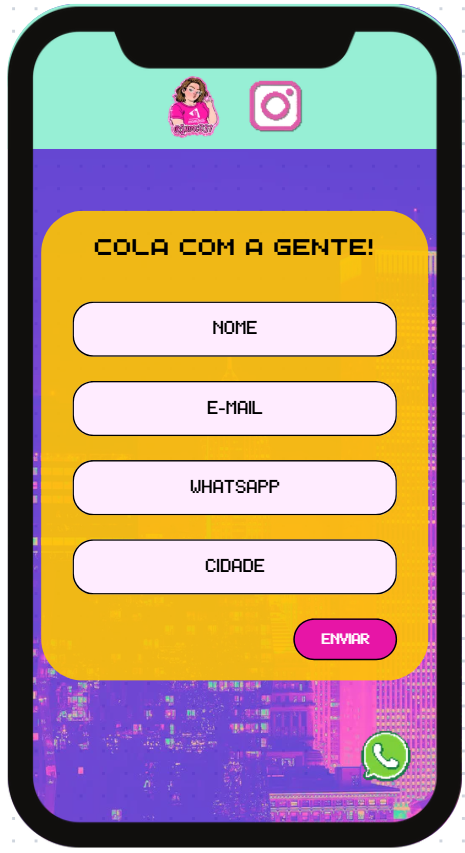
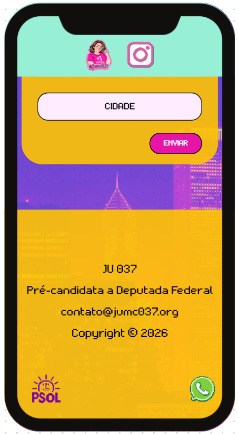

# Ju26 Prototype

## Context

I'm building a landing page that will serve as the online presentation of my public persona as I’m running for deputy in Brazil’s election. I’m an activist, doctor and rapper.

This will be designed as a prototype, filling with template text and media.

## General Specifications

- The page will be highly responsive and designed to be mobile-first thus enhancing user experience. Breakpoints:
  - 320px — 480px: Mobile devices
  - 481px — 768px: iPads, Tablets
  - 769px — 1024px: Small screens, laptops
  - 1025px — 1200px: Desktops, large screens
  - 1201px and more — Extra large screens, TV
- It will bear good on-page structure and clean HTML hierarchy in order to guide humans and bots through content.
- It will present good SEO optimization and be based on static delivered content.
- The website will be very accessible for people with disabilities, meaning:
  - keyboard navigable
  - visible focus ring
  - aria-labels on icon buttons
  - semantic HTML
  - sufficient color contrast
  - alt text for images
  - reduced-motion support
  - skip-to-content link
- The visual identity will be based on vaporwave aesthetics

## Sections

The website should split into sections/blocks, each one with a purpose.

### 1. Homepage Hero

This sections should be clean, impactful and catchy so that people feel curious to dive into my webpage. It should contain:

- My name ”MC JU” at the top left in a big font size (fonts/arcade.ttf)
- My title “Pré-candidata a Deputada Federal” bellow my name (fonts/retropix.ttf)
- My slogan ”Arte, Audácia e Afeto” at the bottom middle, text with background color #FBE006 (fonts/retropix.ttf)
- Instagram icon (icons/instagram.png) and WhatsApp icon (icons/instagram.png) bellow my slogan, also centralized, with mocked hyperlink
- My photo in a big dimension behind the elements described above (photos/ju_1.png)
- A video looping in the background (background_media/loop_video_1.mp4)

#### Visual reference:

### 2. Who am I

From this block to the bottom of the page, two fixed elements should appear with slide-down animation:

- A turquoise header (#97EFD5) bearing two icons in the middle:
  - Sticker (icons/sticker.png) with an anchor to the top of the page
  - Instagram (icons/instagram.png) with a mocked hyperlink
- A floating WhatsApp icon at the bottom right with a mocked hyperlink

The content of this block:

- A yellow centralized wrapper (#FBE006) with rounded corners
- A centralized title “PRA ALÉM DO VULGO” within wrapper (font/arcade.ttf)
- A justified text with 300 characters of lorem ipsum within wrapper (font/retropix.ttf)
- A pink button (#F51357) in the bottom right written “SAIBA MAIS” within wrapper, it triggers the opening of an empty modal on click
- A video looping in the background (background_media/loop_video_2.mp4)

#### Visual reference:

### 3. Agenda

This section should present the main agenda. There are five topics, each one in an individual rounded box with borders and a specific icon and title. The specification of each box is as follows:

- Title: “AMBIENTE” - Icon: icons/environment.png - background color: dark gray
- Title: “CULTURA” - Icon: icons/culture.png - background color: dark gray
- Title: “SAÚDE” - Icon: icons/health.png - background color: dark gray
- Title: “MULHERES” - Icon: icons/women.png - background color: white
- Title: “JUVENTUDES” - Icon: icons/youth.png - background color: white

All boxes should open an empty modal on click and a video should be looping in the background (background_media/loop_video_1.mp4). The section title is “NOSSO PAPO”.

#### Visual reference:

### 4. Supporter form

This section should present a form allowing the user to show support and submit personal data for contact. All texts in this block should use the same font (fonts/arcade.ttf). The form should contain a yellow wrapper with rounded corners (like section 2) and contain the following elements:

- Title (plain text) with content “COLA COM A GENTE!”
- Name input (free text) with placeholder “NOME”
- E-mail input (regex validation) with placeholder “E-MAIL”
- WhatsApp phone number input (regex validation) with placeholder “WHATSAPP”
- City name input (free text) with placeholder “CIDADE”
- Submit pink button (#F51357) in the bottom right written “ENVIAR”

All fields are required. On submit an API call should be made to mockurl.com/send with a JSON payload containing all data and the form should be replaced by an “OK” text (yellow wrapper will be maintained). A static image should serve as the background for this section (background_media/static_image).

#### Visual reference:

## Footer

A simple footer will be displayed at the bottom of the page. All texts in this part should use the same font (fonts/arcade.ttf). It should have yellow background (#FBE006) and contain the following plain text lines (one bellow the other):

- JU 037
- Pré-candidata a Deputada Federal
- contato@jumc037.org
- Copyright © 2026

It should also contain a logo image (icons/psol.png).

#### Visual reference:

## Technical Specifications

### Videos

All videos should have auto play, infinite loop and be muted.

### **Key Components of Page Structure:**

- **Header Tags (H1–H6):** Should act as the outline for content.
  - **H1 Tag:** use exactly _one_ h1 in the landing page, in this case my name
  - **H3 Tag:** subheadings that divide the page into sections/blocks
  - **H4 Tag:** for subtopics nested underneath sections
- **Title Tag:** “MC Ju 036 - Pré-candidata a Deputada Federal"
- **Meta Description: “**Vem conhecer a Ju: MC, médica e ativista**”**
